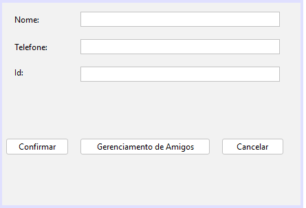
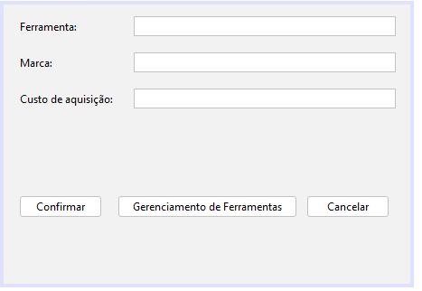
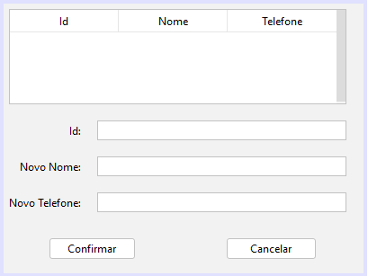
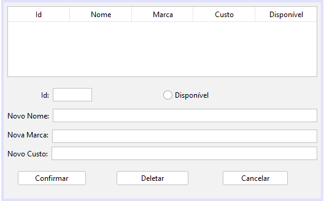
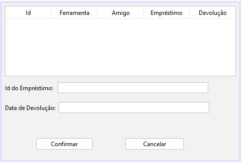
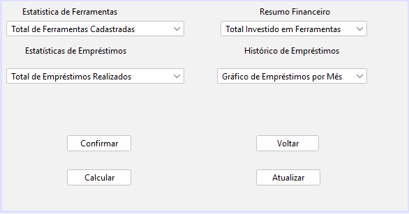

## <h1>Interface Gráfica de Empréstimo de Ferramentas</h1>

## <h3>📍Sobre o Projeto:</h3>

  Este projeto foi estipulado para a realização de uma UC da disciplina de Programação de Soluções Computacionais da Universidade do Sul de Santa Catarina. Trata-se de uma interface gráfica que permite registrar amigos e ferramentas, bem como conceder e gerenciar empréstimos dessas ferramentas para os amigos, com todas as informações armazenadas em um banco de dados MySQL.

## <h3> 👥 Alunos/ Desenvolvedores:</h3>

  Bernardo Santos Vieira - RA: 1072415392 - GitHub: <a href="https://github.com/BernardoSVieira">bernardosvieira</a> 
  Eduardo Alfredo Coelho - RA: 1072419300 - GitHub: <a href="https://github.com/Eduardocoelh0">eduardocoelh0</a> 
  Guilherme Schveitzer - RA: 1072415715 - GitHub: <a href="https://github.com/GuilhermeSchveitzer">guilhermeSchveitzer</a> - PC Gamer 
  Victor Hasse - RA: 10724111755 - GitHub: <a href="https://github.com/victorhasse">victorhasse</a> 
  Vitor Hugo Coelho Vitorino - RA: 1072415406 - GitHub: <a href="https://github.com/Conepotato">conepotato</a> 

## <h3>📖 História:</h3>

  No churrasco de família, seu tio-avô, lhe pediu um software para gerenciar o empréstimo de ferramentas. Ele quer o software que rode localmente no computador dele. A ideia é ter um cadastro de ferramentas (nome, marca, custo de aquisição) e o de amigos (nome, telefone). 
Ele gostaria de registrar os empréstimos de uma ou mais ferramentas a um determinado amigo, marcando a data que ocorreu e também a data de devolução.
Ele pediu que o software tenha um relatório de ferramentas e o quanto ele gastou. Também vai querer outro relatório dos empréstimos ativos e de todos os empréstimos realizados, por algum motivo ele gostaria de saber que é que fez mas empréstimos e se tem alguém que nunca devolveu, inclusive, a cada novo empréstimo ele gostaria de o sistema diga se o amigo ainda tem algo que não devolveu.
Dias mais tarde, ele pediu para aproveitar o cadastro de amigos e criar uma agenda integrada com o google para registrar o convite dos amigos a algum evento, a integração tem como princípio compartilhar o lembrete do evento de forma a ele receber um e-mail

## <h3>✅ Requisitos Funcionais:</h3>

Descrevem as funcionalidades específicas que o sistema ou software deve realizar. Definindo os comportamentos do sistema, ditando o que ele deve fazer, em termos de ações, serviços ou operações. 
São eles:

  - RF001: Registrar novo "amigo" com informações de nome e telefone. 
  - RF002: Registrar ferramentas com detalhes como nome, marca e custo. 
  - RF003: Registrar o empréstimo das ferramentas para o amigo, incluindo as datas de empréstimo e devolução. 
  - RF004: Ao registrar um novo empréstimo, verificar se o amigo possui alguma ferramenta pendente de devolução, sendo capaz de alterar ou remover informações. 
  - RF005: Exibir um relatório de todos os empréstimos em andamento. 
  - RF006: Exibir um relatório de todos os empréstimos realizados. 
  - RF007: Indicar se algum amigo nunca devolveu uma ferramenta. 
  - RF008: Identificar qual amigo realizou o maior número de empréstimos. 
  - RF009: O sistema deve manter uma lista completa de todas as ferramentas e o valor total gasto nelas. 
  - RF010: Tela de estatísticas, serve para dar um panorama geral das informações mais importantes.

## <h3>❌ Requisitos Não Funcionais:</h3>

Responsáveis por definir as características e propriedades de um sistema, que não estão diretamente relacionadas às suas funcionalidades específicas, mas que são igualmente importantes para seu sucesso. Eles descrevem atributos de qualidade, restrições e condições que um sistema deve atender. são responsáveis por impactar na experiência do usuário, envolvendo desempenho, arquitetura. 
São eles:

  - RNF001: O sistema operacional deve ser utilizado no Windows 10. 
  - RFN002: O programa deve rodar localmente em um computador pessoal. 
  - RFN003: O programa deve ser desenvolvido em Java, Na versão 8. 
  - RFN004: O programa deve ser conectado a uma base de dados usando mySQL, Na versão 8.4.0.

## <h3>⚙️ Programas:</h3>

  
  
  

# <h3>💾 Banco de Dados MYSQL:</h3>

O MySQL é um sistema de gerenciamento de banco de dados, que utiliza a linguagem SQL como interface. É atualmente um dos sistemas de gerenciamento de bancos de dados mais populares da Oracle Corporation. 

Usuário: root 
Senha: root

## <h3>💳 Telas Gráficas:</h3>

  Central de Controle:  
  Cadastro de Amigo:  
  Cadastro de Ferramenta:  
  Gerenciamento de Amigo:  
  Gerenciamento de Ferramenta:  
  Conclusão de Empréstimo:  
  Emprestimo de Ferramenta:  
  Relatório de Emprestimo:  
  Relatório de Ferramenta:  
  Tela de Estatisticas:  
  

